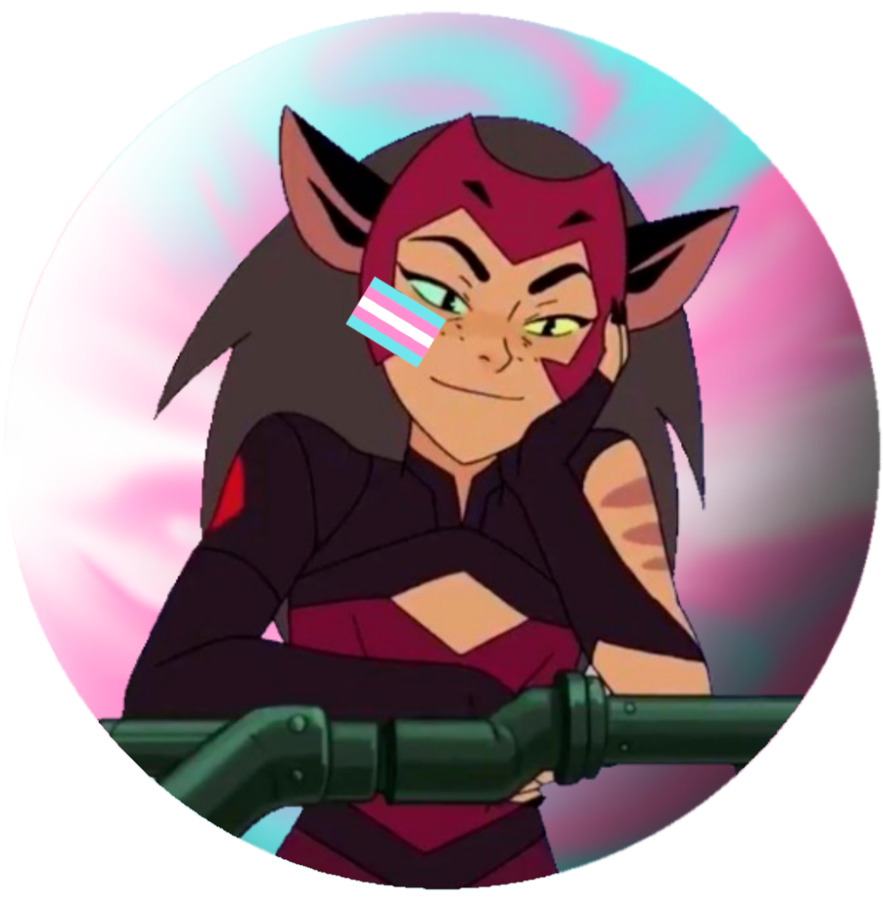
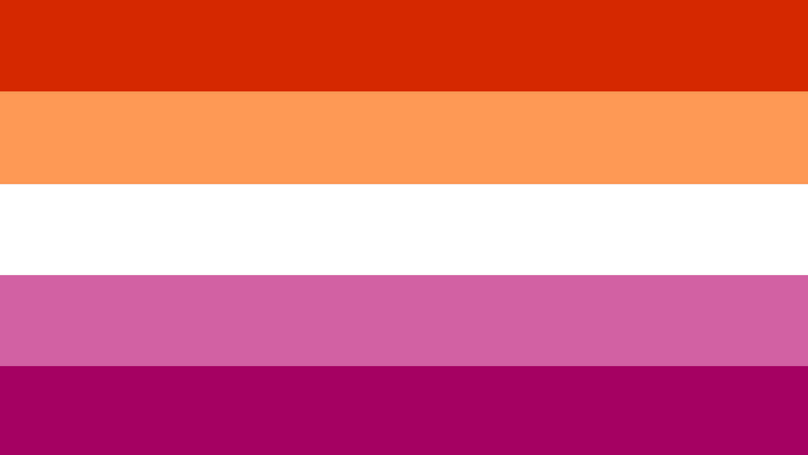
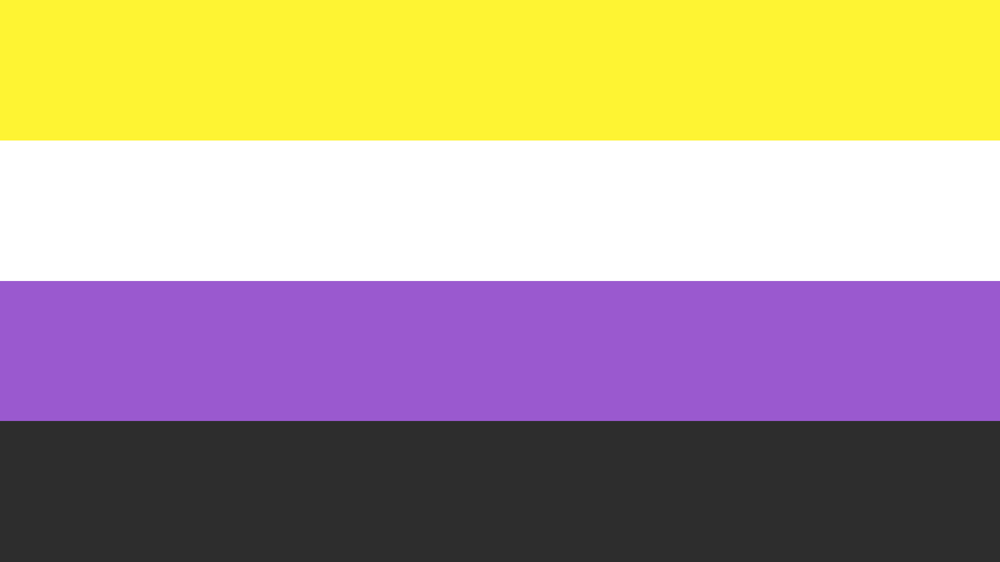
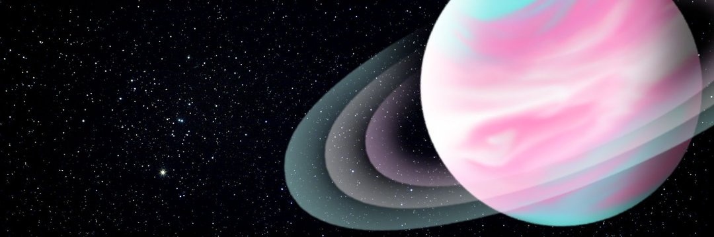

# about

Write your about.

----------------------

## names
- **sev**
- cass

----------------------

## pronouns 1
- [they/them](theythem.png)
- [he/him](hehim.png)

----------------------

## pronouns 2
- they/them/their/theirs/themselves
- he/him/his/his/himself

----------------------

## pronouns 3
- they/them<a href="/" title="they/them/their/theirs/themselves">*</a>
- he/him<a href="/" title="This morning, he went to the park. I went with him. And he brought his frisbee. At least I think it was his. By the end of the day, he started throwing the frisbee to himself.">*</a>

----------------------

## pronouns 4
A list of my pronouns!

### **they/them**

- This morning, **they** went to the park. 
- I went with **them**. 
- And **they** brought **their**  frisbee. 
- At least I think it was **theirs**. 
- By the end of the day, **they** started throwing the frisbee to **themselves**.

### **he/him**

- This morning, **he** went to the park. 
- I went with **him**. 
- And **he** brought **his** frisbee. 
- At least I think it was **his**. 
- By the end of the day, **he** started throwing **the** frisbee to **himself**.

----------------------

## terms
- masc and neutral

----------------------

## flags
 **lesbian**  **nonbinary**

----------------------

## links
- [curiouscat](http://curiouscat.qa/theybian)

----------------------

## twitter accounts
- [main](http://twitter.com/theybian)
- [positivity](http://twitter.com/agenderlesbians)

